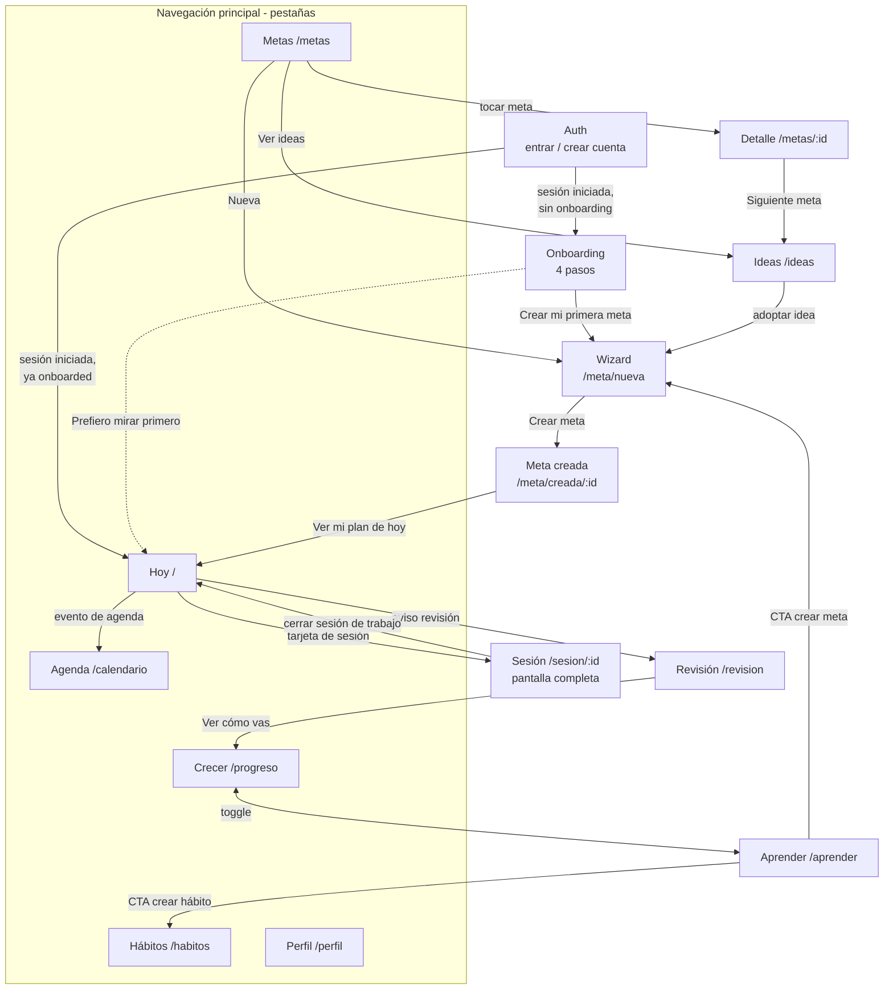
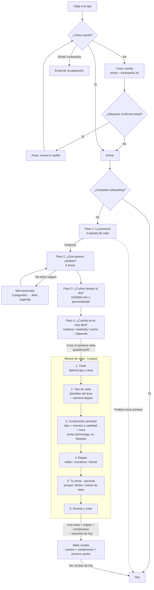
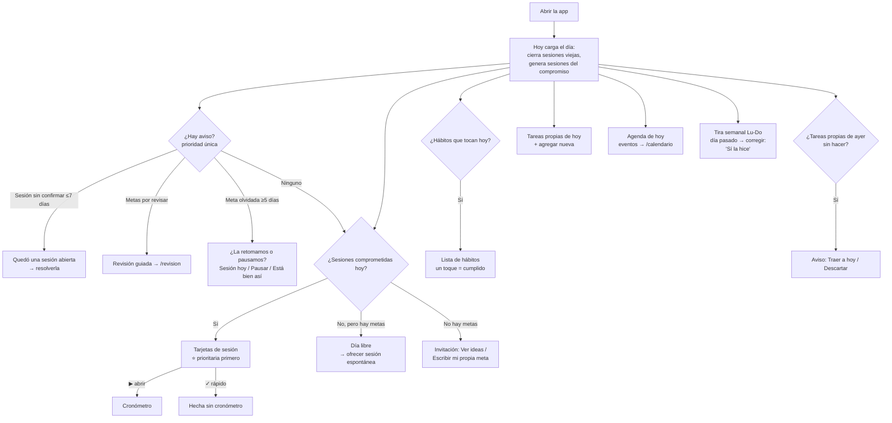
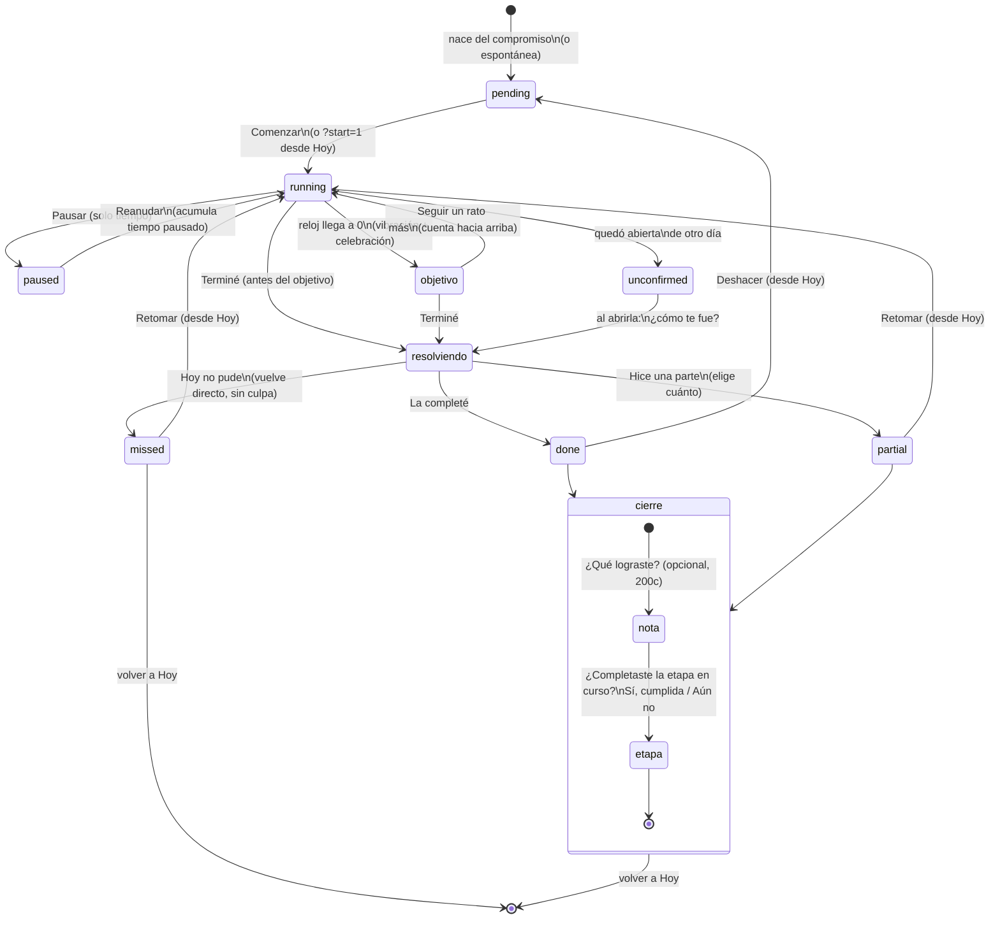
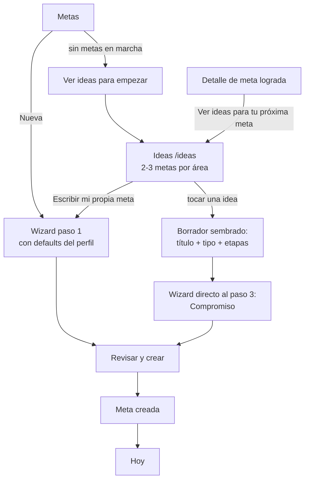
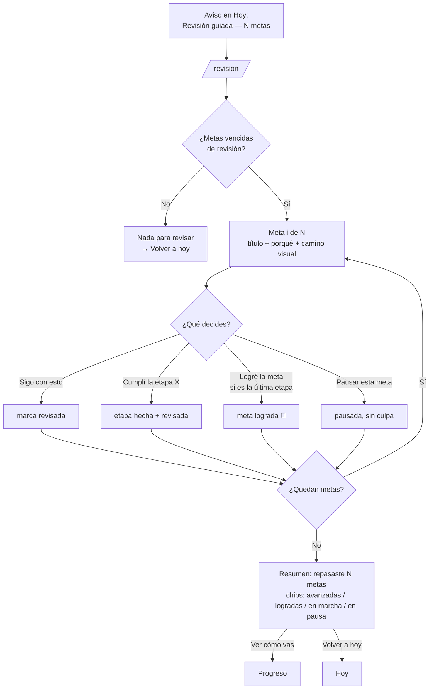
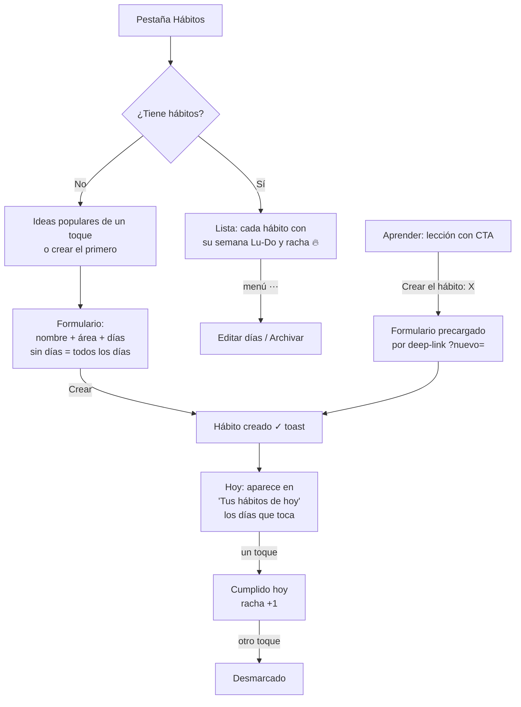
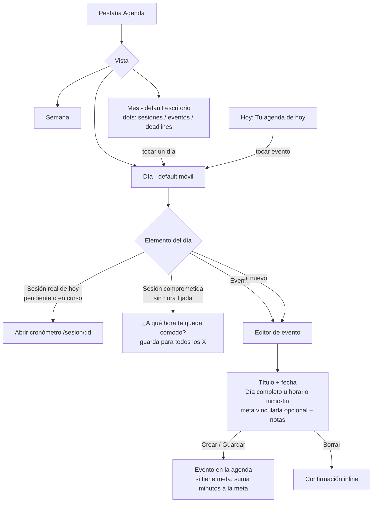

# Lógralo — Flujogramas de uso

> Generado el 2026-06-12 a partir del código real (rutas en `src/App.tsx`, pantallas en `src/screens/`). Los diagramas son Mermaid: GitHub y VS Code los renderizan.

## Mapa de navegación global

---

## F1 · Alta y primera meta (el embudo completo)

Notas del código:
- El borrador del wizard se guarda en `sessionStorage` en cada cambio y se limpia al crear (`Wizard.tsx:154-186`, `:243`).
- Adoptar una idea desde `/ideas` siembra el borrador y entra directo al paso de compromiso (`wizardDraft.ts:13-39`).
- "Prefiero mirar primero" deja el onboarding incompleto: intentar `/meta/nueva` redirige a `/onboarding` (`App.tsx:140-142`).

---

## F2 · El día a día (Hoy)

---

## F3 · Una sesión de trabajo (máquina de estados)

Notas del código:
- El reloj se calcula por timestamps (`startedAt`, `pausedTotalSeconds`), no por timers: cerrar la app no lo rompe (`domain/sessions.ts:12-32`).
- "Hoy no pude" cierra sin pedir nota ni etapa — fricción cero a propósito (`SessionRun.tsx`, ResolutionOptions).
- La racha cuenta días comprometidos con sesión done/partial; los días libres no la rompen (`currentStreakCommitted`).

---

## F4 · Crear una meta más (usuario existente)

---

## F5 · Revisión semanal guiada

---

## F6 · Hábitos

---

## F7 · Agenda (calendario propio)

